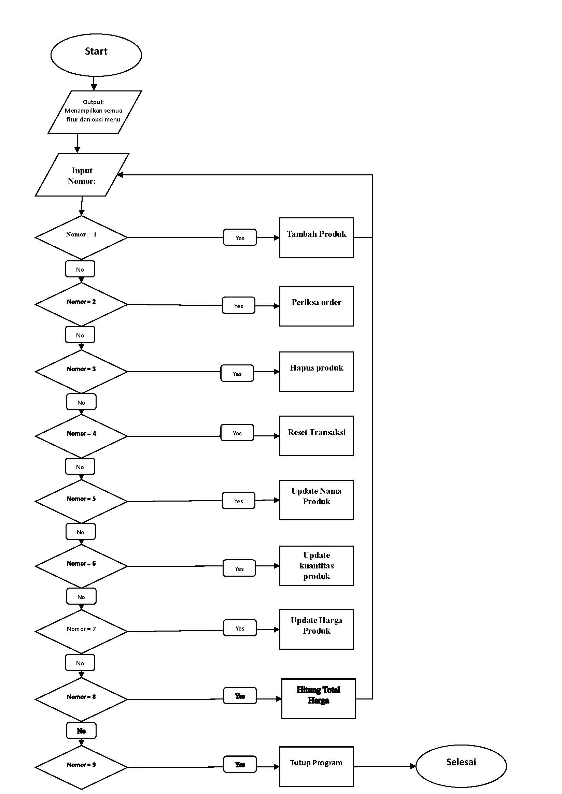
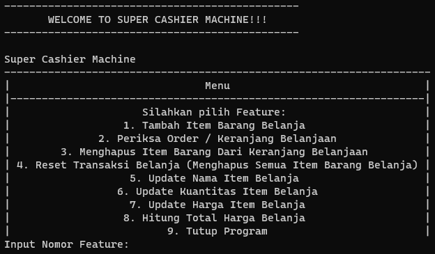
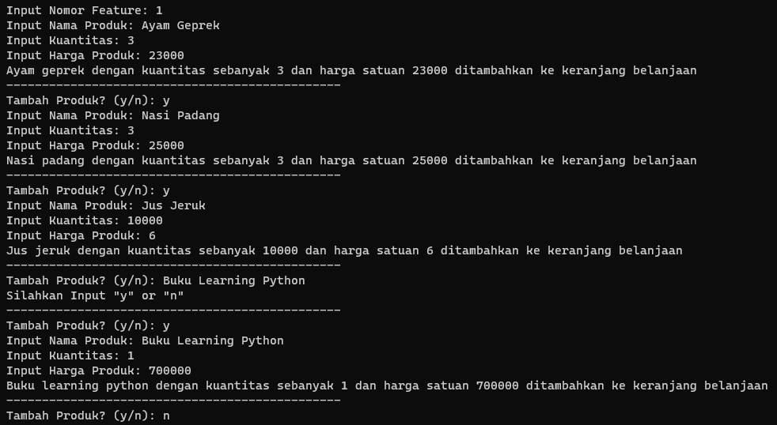
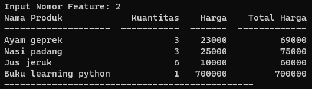
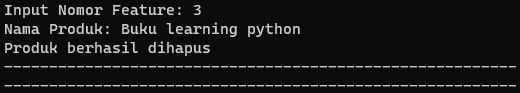
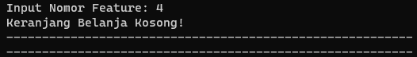
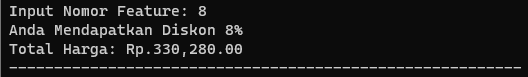

# Python Project: Super Cashier Machine

## A. Project Background
Andi adalah pemilik supermarket besar di salah satu kota di Indonesia. Andi memiliki rencana untuk meningkatkan usahanya, dengan membuat sistem kasir swalayan di supermarket miliknya. Dengan menggunakan kasir swalayan, pelanggan dapat menambahkan barang yang dibeli, jumlah barang yang dibeli, harga barang yang dibeli dan menggunakan fitur lainnya. Dengan demikian, pelanggan dapat membeli barang dari supermarket dari jarak jauh. Setelah melakukan riset, Andi menyadari bahwa dirinya membutuhkan bantuan seorang Programmer untuk membuat dan memastikan sistem kasir swalayan ini dapat berjalan dengan lancar.

## B. Objective
Learning objective: 
* Buat program dengan UI sederhana menggunakan Python
* Menggunakan OOP untuk membuat program Python
* Menerapkan prinsip PEP8 untuk menulis program Python yang bersih
* Menerapkan konsep kode modular dalam pemrograman python

Program objective: 
* Menambahkan item baru ke keranjang belanja
* Tampilkan / periksa item di keranjang belanja
* Hapus item dari keranjang belanja
* Hapus semua item dari keranjang belanja (reset transaksi)
* Memperbarui nama item
* Memperbarui jumlah barang
* Memperbarui harga barang
* Hitung total harga

## C. Modular Code Description
Berdasarkan tujuan program sebelumnya, ada dua kode modular yang perlu dibuat.

### Transaction.py
Modul ini terdiri dari kelas Transaksi dan metodenya. Berikut adalah deskripsi dari masing-masing metode di kelas Transaksi:

_Diagram 1: Description of Transaction class' methods_ \

### Cashier.py
Modul ini terdiri dari UI sederhana/menu utama sederhana untuk program kasir swalayan. Modul ini menggunakan modul Transaksi (dengan mengimpor semua metode). Berikut adalah flowchart Cashier.py dan menu utama sederhana dari program kasir swalayan:

_Diagram 2: Super Cashier Machine simple main menu flowchart_ \

_Diagram 3: Super Cashier Machine simple main menu_ \

## D. Panduan Penggunaan Program Kasir Swalayan
1. Unduh repositori git ini ke komputer lokal Anda.
2. Pastikan pustaka tabulasi telah diinstal.
3. Jalankan "Cashier.py" di folder "Modular Code" dengan menggunakan terminal.

## E. Test Case

### Test Case 1: Adding Items

Adding an item to shopping cart\

Checking the shopping cart\

Deleting "Pasta gigi"\

### Test Case 3: Resetting transaction
Resetting transaction\

### Test Case 4: Calculating Total price
Calculating total price\

## F. Conclusion
Secara keseluruhan, program berjalan sebagaimana mestinya. Namun, program ini masih memiliki banyak kemungkinan perbaikan, misalnya:
* Meningkatkan UI;
* Menambahkan lebih banyak fitur;
* Mengintegrasikan program dengan data daftar barang supermarket.